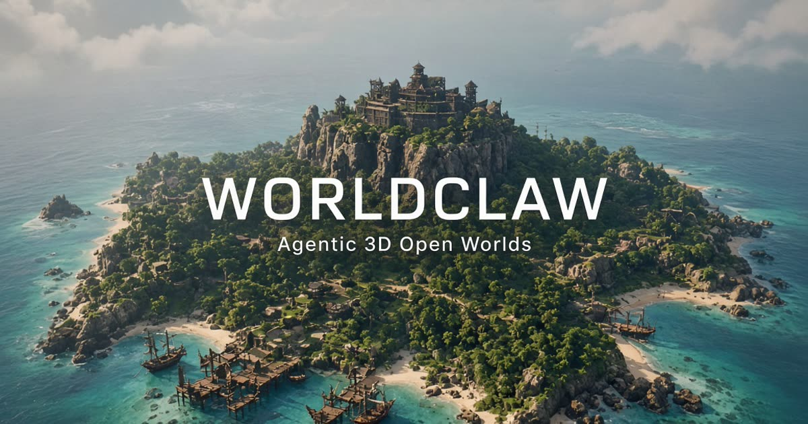

# WorldClaw



Browser app that turns an open-ended text prompt into an explorable 3D world. A model committee plans the scene and draws layout/reference images; deterministic code builds terrain, places authored assets, and fails closed when required objects are missing.

This is a working candidate, not a certified recreation of the paper. See [docs/paper-superiority-scorecard.md](docs/paper-superiority-scorecard.md) for the claim boundary.

## What you get

- **`/`** — prompt → generate → orbit or walk a Three.js world
- **`/assets`** — published GLB kit, turnarounds, materials, variant compare
- Process panel pages: **Run**, **Models**, **World**, **Library**
- View modes: Lit, Instance, Depth, Normal
- Failed and rejected model stages stay inspectable (images, scores, lineage)

Presets include tropical pirate island, canyon villages, desert battlefield, snow tech valley, medieval village, volcanic lair, Japanese island towns, and gemstone mine.

## Pipeline

```
prompt → plan → terrain → regional objects → compose
```

1. **Committee** — xAI, Gemini, OpenAI, and Claude (via AI Gateway) propose plans and images. Ordinary preview stops after two usable results; the paper suite uses the full roster.
2. **Deterministic build** — semantic land/water, named regions, collision-aware placement, harbor berths, authored GLB instances. Primitive fallback is recorded, not hidden.
3. **Evidence** — registered map / isometric / oblique / walk captures plus instance, depth, and normal diagnostics.

Without API keys the planner falls back to local templates so the renderer still runs.

## Stack

React 19, TanStack Start, Three.js (`@react-three/fiber`), Tailwind v4, Zustand. Blender is an **offline compiler** for the asset kit, not a runtime dependency.

| Role | Default model |
| --- | --- |
| xAI text / vision | `grok-4.6` |
| xAI image | `grok-imagine-image-quality` |
| Gemini text / vision | `gemini-3.6-flash` |
| Gemini image | `gemini-3-pro-image` |
| OpenAI text / vision | `gpt-5.6-sol` |
| OpenAI image | `gpt-image-2` |
| Anthropic text / vision | `anthropic/claude-opus-5` via AI Gateway |

Override with `XAI_TEXT_MODEL` and the other keys in `.xai_env.example`.

Published kit (frozen until you rebuild): 27 prototype families, 34 authored variants, ~1.68 MiB GLB, validator-passed. Paper `animals` are explicitly unsupported.

## Setup

Node 22+.

```sh
npm install
cp .xai_env.example .xai_env   # optional; fill keys for live models
npm run dev                    # http://127.0.0.1:8080
```

`vite.config.ts` and `startup.sh` both load `.xai_env`. Keys stay server-side.

```sh
npm test
npm run typecheck
npm run lint
npm run build
node scripts/blender/validate-worldclaw-kit.mjs
```

Paid paper runs spend real quota. Dry-run first:

```sh
npm run qa:worldclaw:paper -- --dry-run --case figure-12-japanese-island-towns
```

Only run `--allow-paid-model-calls` when you mean to.

Asset rebuild (needs Blender 5.x, or `BLENDER_BIN`):

```sh
npm run assets:build
npm run assets:validate
```

## Layout

| Path | What |
| --- | --- |
| `src/components/worldclaw/` | Viewport, panel, evidence UI |
| `src/lib/worldclaw/` | Pipeline, terrain, placement, providers |
| `src/routes/` | `/` and `/assets` |
| `public/worldclaw/` | Published GLB, dossiers, layout maps |
| `assets/worldclaw/` | Source manifest + paper suite contract |
| `scripts/` | Tests, QA harnesses, Blender kit |
| `attachments/2608.05248v1.pdf` | Hash-locked paper PDF |
| `docs/paper-superiority-scorecard.md` | Evaluation gates |
| `status.md` / `progress.md` | Current position / historical run ledger |

Not in git: `.vercel/`, `output/`, `artifacts/`, `screenshots/`, `node_modules/`, `.xai_env`.

## Paper

Chen et al., *WorldClaw: Agentic 3D Open-World Generation at Scale*, [arXiv:2608.05248](https://arxiv.org/abs/2608.05248). Case list and page hashes live in `assets/worldclaw/reference-validation/paper_prompt_suite.json`.
